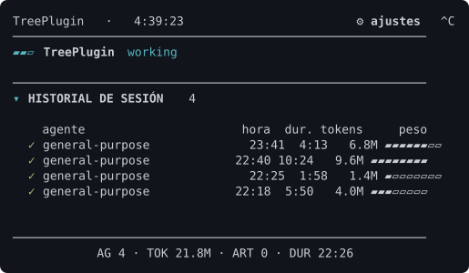

# Agents Tree

**Subagent visibility for agent CLIs, inside [Herdr](https://herdr.dev).**
A compact tree in the sidebar, an expanded dashboard in a pane — driven
entirely by lifecycle hooks. It never reads a terminal.


[Install](#install) · [Quick start](#quick-start) · [Keybindings](#keybindings)
· [Reading the panel](#reading-the-panel) · [Settings](#settings-the-in-panel-gear-menu)
· [How it works](#how-the-tree-is-joined) · [Limitations](#limitations)
· [Troubleshooting](#troubleshooting) · [License](#license)

---



<sub>Generated, not hand-drawn: `python3 scripts/capture-preview.py` renders one real
frame through the panel's own `render_frame()`, so the preview cannot drift into
showing a layout the code no longer produces.</sub>

## What it gives you

- **A sidebar tree** of live subagents, published as Herdr metadata tokens —
  it never overwrites Herdr's own agent state.
- **A dashboard pane** with the live tree, session history, published
  artifacts, and a footer summary.
- **Per-subagent history**: duration and token cost for every delegation that
  finished, with a weight gauge that shows *which* one was expensive.
- **An artifact log** of every real publish, clickable from the panel.
- **Hook-driven only.** No terminal reads, no polling, no API keys.

Recognized agents: **Claude Code**, **Codex**, **Pi**. Anything Herdr detects
as something else is left alone rather than guessed at, so an unrelated
session's history and artifacts can never leak into the panel.

## Requirements

- **Herdr 0.8+** (the plugin system).
- **Python 3.10+** on `PATH`. No build step, no toolchain — the plugin is
  plain Python.
- **Linux.** The hooks use `fcntl` file locking.
- **At least one recognized agent CLI** — Claude Code, Codex, or Pi.

What each runtime can actually prove differs, and the panel never claims more
than its source supports:

| Runtime | Presence | Live activity | Session end |
| --- | --- | --- | --- |
| Claude Code | full hook coverage | complete (every child accounted for) | supported |
| Codex | hook-compatible wiring only | partial (opportunistic reuse of Claude's payload shape) | unsupported (unverified) |
| Pi (companion extension) | its own top-level session only | partial (its own tool calls, not nested delegation) | supported (its own native event) |

## Install

```sh
herdr plugin install SpidySamurai/claude-vezmex-team-tree
```

Herdr registers the plugin, and the plugin's startup hook wires itself into
each agent settings file it finds. There is no separate install step.

<details>
<summary><b>What gets wired, and where</b></summary>

The panel never reads a terminal, so lifecycle hooks are its only source of
truth. The startup hook adds these entries to `~/.claude/settings.json`,
`~/.claude-work`, `~/.claude-vezmex`, and `~/.codex/hooks.json` — whichever
of them exist:

| event | script | what it feeds |
|---|---|---|
| `SessionStart` | `claude_profile_hook.py` | the session, its profile and start time |
| `SessionEnd` | `claude_profile_hook.py` | the end marker (see [When the session ends](#when-the-session-ends)) |
| `SubagentStart` | `claude_subagent_hook.py` | the live tree |
| `SubagentStop` | `claude_subagent_hook.py` | the historial |
| `PostToolUse` | `claude_artifact_hook.py` | published artifacts |

A profile directory with no `settings.json` is one you do not use, so it is
skipped rather than created. Each file is backed up once as
`<name>.agents-tree.bak` before its first edit, and the wiring never touches
a hook it did not add.

Because the wiring is idempotent and re-checked at every Herdr start, it also
**self-heals**: reinstalling the plugin replaces Herdr's managed checkout, and
the next startup repoints the hooks at the new path on its own.

</details>

### Updating

There is no `plugin update` in Herdr v1 — reinstall to refresh:

```sh
herdr plugin install SpidySamurai/claude-vezmex-team-tree
```

Your settings survive: they live in the plugin's own config directory, keyed
by plugin id, not in the checkout.

### Removing

```sh
herdr plugin uninstall spidysamurai.agents-tree
```

To also unwire the agent hooks, run `python3 install.py --uninstall` from the
checkout before uninstalling. That removes only what this plugin wrote, and
records that you opted out, so a later start will not silently re-wire you.

### From a clone (local development)

```sh
git clone https://github.com/SpidySamurai/claude-vezmex-team-tree
cd claude-vezmex-team-tree
make install     # herdr plugin link + wire the hooks
make check       # report what is wired right now, change nothing
make uninstall   # remove only what the installer wrote
make test
```

`herdr plugin link` is the local-development path: Herdr resolves every
command in the manifest against the plugin root, so it has to know where the
checkout is.

## Quick start

1. **Bind a key.** Herdr has no menu or palette for plugin actions, so add the
   binding yourself (see [Keybindings](#keybindings)).
2. **Restart your agent CLI.** A running session keeps the hook paths it
   started with.
3. **Open the dashboard.** With no agent running you get the idle screen; start
   a session and delegate once, and the tree fills in.

## Keybindings

`~/.config/herdr/config.toml`:

```toml
[[keys.command]]
key = "prefix+alt+a"
type = "shell"
command = "herdr plugin action invoke open-dashboard --plugin spidysamurai.agents-tree"
description = "open the Agents Tree dashboard"
```

The plugin also ships `refresh-agent-tree`, `configure-dashboard`, and
`install-profile-resume` actions, bindable the same way.

## How the tree is joined

The dashboard never runs `herdr pane read` (or any other terminal read). Herdr
locates the agent pane and supplies its associated session identifier. The tree
then comes entirely from local hook state:

- `SubagentStart`: `{session_id, agent_id, agent_type}` → working/spinner
- `SubagentStop`: `{session_id, agent_id, agent_type, ...}` → done

Claude documents that these event payloads retain the parent session's
`session_id`; Herdr records that ID as the pane's `agent_session.value`. That
exact match is the join key. The panel labels each child with its agent type
and a short suffix of its event ID, and reports its hook state as
working/spinner or done.

## Session history and artifacts

A finished subagent is removed from the live tree, not kept as "done" — it
moves into a session history log instead (`history.jsonl`), with its name,
start/stop time, duration, and a token total read from its own transcript
(`agent_transcript_path` on `SubagentStop`; hook payloads carry no token count
directly). `claude_team_tree.py` renders this as a HISTORIAL section below the
live tree, capped to the most recent entries.

A second hook, `claude_artifact_hook.py`, wires into `PostToolUse` and logs
every real `Artifact` tool publish/update (`artifacts.jsonl`) — filtered to the
`publish` action only, so read-only calls (`status`, `list`, ...) are never
logged. Rendered as an ARTIFACTS section, with a footer line summing
agents/tokens/artifacts/duration for the session.

Token *session* totals (context occupancy, account quota) are intentionally out
of scope here — installed
[herdr-token-dashboard](https://github.com/Davidcreador/herdr-token-dashboard)
covers that at the session/pane level; this plugin stays focused on per-subagent
history and artifacts.

## When the session ends

Leave the agent CLI while the panel is open and everything in it becomes a
post-mortem, so the panel says so instead of presenting stale data as live.
The `SessionEnd` hook records an `ended` timestamp, and from then on:

- the session clock **freezes** at the moment it ended, rather than counting
  up forever against a session that is gone
- the root goes `ended` (`○`, grey) — no more spinner
- any subagent still marked `working` becomes `interrupted` (`▪`): nothing
  wrote its `SubagentStop`, because the CLI was killed out from under it
- the header trades its close hint for `⚙ finalizada` when the pane is too
  narrow for both — the gear is never what gets dropped, since it is the only
  way to open the settings menu

History and artifacts stay on screen and the gear menu keeps working, so the
panel is still readable (and its artifact links still clickable) after the
session it describes is over. Resuming that same session clears the mark and
the panel goes live again.

Claude Code proves this directly, through its own `SessionEnd` hook. Pi
proves it too, through its own native shutdown event: the companion extension
emits `session_shutdown`, the runtime-observability layer normalizes that
into a `presence: "ended"` canonical record, and this root-level freeze-clock
falls back to that record whenever `profiles.json` has none for the session —
keyed by `(runtime, raw session id)`, since raw ids can collide across
runtimes. Codex's `SessionEnd` hook is wired the same way `install.py` wires
Claude's, so it would freeze the same way — but only that hook-compatible
surface is verified in this repository, so Codex's own capability declaration
still reports session end as unsupported/unverified, and that is not claimed
as solved here.

## Runtime observability (internal)

Live children in the tree (the section above) come from one shared reader in
`src/runtime_observability/`, not from raw hook-file parsing in the sidebar or
dashboard. It normalizes Claude Code, Codex, and Pi evidence into one
canonical snapshot at `$XDG_STATE_HOME/herdr/claude-vezmex-team-tree/runtime-observability.json`,
additive beside the existing `subagents.json`/`history.jsonl`/`artifacts.jsonl`/
`profiles.json` files, which keep their current behavior unchanged. Herdr
remains the authority for which panes are visible leaders; this layer only
enriches what Herdr already exposes, and never reads terminal output.

Each runtime declares what it can actually prove, so an empty result reads as
*unknown* rather than a fabricated idle/done/zero-active claim. The
[capability table](#requirements) above is that declaration.

Codex is attributed correctly — `install.py` wires `.codex/hooks.json` with an
explicit `--runtime codex` flag on the same scripts Claude uses, migrating an
existing pre-flag wiring in place — but its capabilities stay conservative
because only that hook-compatible surface is verified in this repository.

The Pi companion collector (`pi/herdr-agent-observability/index.ts`) is
optional and explicit, never auto-installed:

```sh
python3 install.py --link-pi-extension   # symlinks it into ~/.pi/agent/extensions/
python3 install.py --check               # also reports its current status
```

It observes only the current Pi process's own top-level session — its agent
loop, its own tool calls, its own shutdown — never a nested delegation such as
AskClaude, and never terminal output. `--uninstall` removes only a link this
installer created; a foreign directory at the same path is left untouched,
matching the hook `unwire()` safety rule.

## When there is no agent

A pane whose workspace has no recognized leader gets a deliberate idle
screen — a centred ASCII mandala — instead of an empty panel with broken
sections, or another pane's history and artifacts.

There used to be a fallback here: when Herdr detected no agent at all, the
panel dug up a past Claude session from `profiles.json` that had run in the
same working directory. That seemed reasonable until it was actually tested —
cwd is shared by every past session in a project, so what it produced in an
agent-less pane was some unrelated session's history and artifacts, presented
as if they belonged here. Recorded state that merely shares a cwd is not
evidence anything is running; the fallback is gone.

The art is a 12-petal rose curve (`r = cos(6·θ)` in polar form, filled and
shaded by distance from the boundary), not drawn by hand — its mirror axes
hold exactly, by construction, since the formula only depends on `|cos|` and
the radius. It spins: 12 rotation frames per size are generated once and
baked into the source (the shape's own 12-fold symmetry means a 1/12th turn
already loops back onto the start), cycled by the same frame counter that
drives the working-status spinner. `idle_screen()` picks the widest of two
sizes that fits the pane (plain ASCII — box-drawing and emoji presentation
vary by font, and tofu is exactly the broken state
this replaces), or neither below ~26 columns, and centres the block both
ways.

## Reading the panel

Beyond the tree, history and artifacts, the panel earns its width in a few
specific ways:

- **Sections fold.** `HISTORIAL DE SESIÓN` and `ARTIFACTS` each carry a marker
  (`▾` open, `▸` folded) and their count, and the header row is a click
  target. Folding the history brings the artifacts into view without touching
  the pane's scroll. The fold is persisted, so it survives a reopen.
- **A weight gauge** trails each history row when the pane is wide enough for
  it without starving the name column: eight cells, normalised to the
  heaviest subagent of the session. It turns the token column into a profile
  you can read without comparing digits — it says *which* delegation was
  expensive, not how much it cost in absolute terms.
- **A live subagent says how long it has been running**, on its own dim line
  under its tree row. That is the only live per-subagent fact the hooks
  record; a subagent with no recorded start time gets no line rather than an
  invented elapsed time. A live tool tally would need `PostToolUse` to
  attribute each call to the running subagent, which it does not do today.
- **A problem band** appears directly under the header, and only when
  something is blocked or interrupted, naming what is stuck. A blocked
  subagent was otherwise one coloured dot among coloured dots.
- **The gear is a chip**, not a glyph — inverted, using the same background
  the history already stripes with, because a grey `⚙` at the end of a grey
  line does not read as something you can click.

### Clicks resolve against the drawn frame

`render_frame()` returns the text *and* a map of which row carries which
click target; `handle_click()` resolves a click through that map. Nothing
depends on a row number fixed in advance, which is what lets a section fold,
the problem band appear, or the menu open without a click ever landing on the
wrong control.

### One column of margin

The panel draws one column short of the width the terminal reports
(`usable_columns()`). Measured in a real pane, a row built at exactly the
reported width loses its last character on screen — the close shortcut
renders `^` instead of `^C`, an eight-cell gauge shows seven. A wrap test in
a plain pane rules out double-width glyphs as the cause, so this leaves the
last column unused rather than pretending to explain the terminal.

## Settings: the in-panel gear menu

The dashboard's header row carries a gear. **Clicking it opens a settings menu
inside the panel** — no editor, no separate pane:

```
Plugin   ·   1:13:32                     ⚙ ajustes  ^C
  ⚙ AJUSTES  click der: atrás                    ✕ cerrar
  Detalle                                 compact  (2/3)
  Historial                                    30  (3/4)
  Artifacts                                    15  (3/4)
  Ancho panel                                0.28  (2/4)
```

Every row is a click target: left click steps a setting to the next preset,
right click steps back, and `(2/3)` says where the current value sits in its
cycle. The title row closes the menu, as does clicking the gear again.

Clicks arrive as SGR mouse reports (`\033[?1000h\033[?1006h`) with stdin in
cbreak mode — without cbreak the click bytes stay buffered by the tty driver
and never reach `select()`. Hit-testing is by row, resolved through the target map the frame carries.

A cycled value is written straight to `config.json`, which `render()` reads
back on the next frame, so settings also apply to a running dashboard when
edited by hand. Only Python changes need a restart.

`dashboard_config.py` run directly (the "Configurar dashboard" action) opens
that same file in `$EDITOR` for the settings the menu does not expose.

### Overflow and scrollback

Closed, the panel prints more history and artifacts than fit, so the pane's own
scrollback reveals older entries. Open, that would scroll the header — and with
it the gear and the menu — off the top, breaking the row-based click mapping. So
while the menu is open the frame is clipped to the viewport: the oldest body rows
are dropped, the pinned footer is kept, and the cut is stated as
`+N filas ocultas` rather than silently swallowed.

Nothing in the panel truncates a value it could wrap instead; the footer wraps
across lines rather than ellipsizing.

## Profile-aware resume

`Install Claude profile resume` installs a reversible `claude` launcher. Each
profile's SessionStart hook records its `session_id` and `CLAUDE_CONFIG_DIR`.
When Herdr later runs `claude --resume <session_id>`, the launcher restores the
matching profile before delegating to the original Claude binary. It supports
the default, work, and Vezmex Claude configuration directories.

To revert, run `python3 install_profile_resume.py --uninstall` from the plugin
directory. The original `~/.local/bin/claude` launcher is restored; recorded
session mappings are retained but ignored.

## Limitations

Stated plainly, because a panel that overclaims is worse than one that says
it does not know:

- **Session end freezes the clock for Claude Code and Pi.** Codex's
  `SessionEnd` hook is wired the same way as Claude's, but only that wiring
  is verified in this repository — Codex's own session-end capability stays
  unsupported/unverified, so it is not claimed as solved.
- **Codex capabilities are conservative by design.** Only the hook-compatible
  surface is verified in this repository, so completion and artifacts are
  reported as unsupported rather than guessed.
- **The Pi collector sees only its own top-level session** — its agent loop,
  its own tool calls, its own shutdown. Never a nested delegation such as
  AskClaude, and never terminal output.
- **No live per-subagent tool tally.** That would need `PostToolUse` to
  attribute each call to the running subagent, which it does not do today.
- **Linux only**, because the hooks use `fcntl` locking.

**Out of scope for this layer:** dashboard/sidebar visual redesign, history
and artifact redesign, Claude transcript analytics generalization, the
profile-resume freeze-clock above, and API-key-based polling. Rollback is
additive-safe: delete `runtime-observability.json` and nothing else depends
on it existing.

## Troubleshooting

**The panel is empty / no subagents appear.** A running agent session keeps
the hook paths it started with. Restart the CLI after any wiring change.

**I moved the checkout and everything stopped.** The manifest's commands are
relative to the plugin root, but the hook commands written into each agent's
settings file are absolute. The startup hook repairs this on the next Herdr
start; `python3 install.py --check` reports the current state without
changing anything.

**`make check` says `0/5 wired` for Codex.** Codex is wired with an explicit
`--runtime codex` flag on the same scripts Claude uses. If your
`.codex/hooks.json` predates that flag, re-running the installer migrates it
in place.

**Nothing is wired and the startup hook is not fixing it.** If you previously
ran `install.py --uninstall`, that recorded an opt-out so you would not be
silently re-wired. Run `python3 install.py` once to opt back in.

**Clicks land on the wrong row.** The panel resolves clicks against the frame
it actually drew, so this should not happen — if it does, it is a bug worth
reporting with the pane width.

## Tests

```sh
make test
```

Every test isolates its state through a temporary `XDG_STATE_HOME`, so a run
never touches the real config, history, or launcher.

## License

MIT — see [LICENSE](LICENSE).
